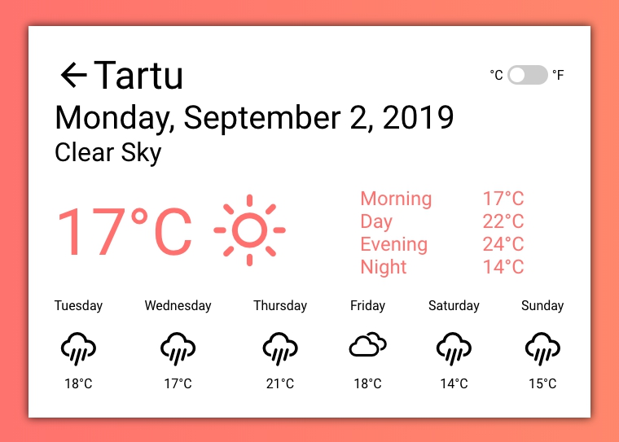

# Proekspert Weather 

    

## Technologies 
1. [Angular](https://angular.io/) + Angular Cli
2. [OpenWeather Api](https://openweathermap.org)
3. Karma + Jasmine - testing
4. [Travis](https://travis-ci.org/) - auto testing and deploy

## Run locally
1. Be sure you have installed `node 10.16.3`
2. Install dependencies `npm install`
3. Run tests `npm test`
4. Run development server `npm start` - Navigate to `http://localhost:4200/`

## Project features
- Search city with autocomple or use current user position
- Display weather for current day
- Display forecast for 6 days
- Change °C to °F
- Store user selected city in `LocalStorage`

## Project Architecture
All Project are divided on several components:
- App - base application component
- CityAutocomplete - represent cities autocomplete
- WeatherForecast - represent weather information

Services:
- CityList - unzip cities form `city.list.json.gz`
- WeatherForecast - get *current* and *daily forecast* weather
- WeatherForecastConfig - `InjectionToken` that used for easy configuration `apiToken` for openWeather Api

Pipes:
- WeatherIconPipe - parse weather condition and return necessary icon
- TemperaturePipe - add `°C` or `°F` to the temperature value

Common Components:
- Autocomplete - autocomplete component that can be used in different projects
  - Option - Simple option autocomplete

## Project dependencies
- [AngularCDK](https://material.angular.io/cdk/categories) - using for autcomplete
- [angular-cli-ghpages](https://github.com/angular-schule/angular-cli-ghpages) - deploy application to gh-pages
- [AngularPWA](https://www.npmjs.com/package/@angular/pwa) - building PWA
- [WeatherIcons](https://erikflowers.github.io/weather-icons/)
- [pako](https://github.com/nodeca/pako) - unzip city.json.gz
